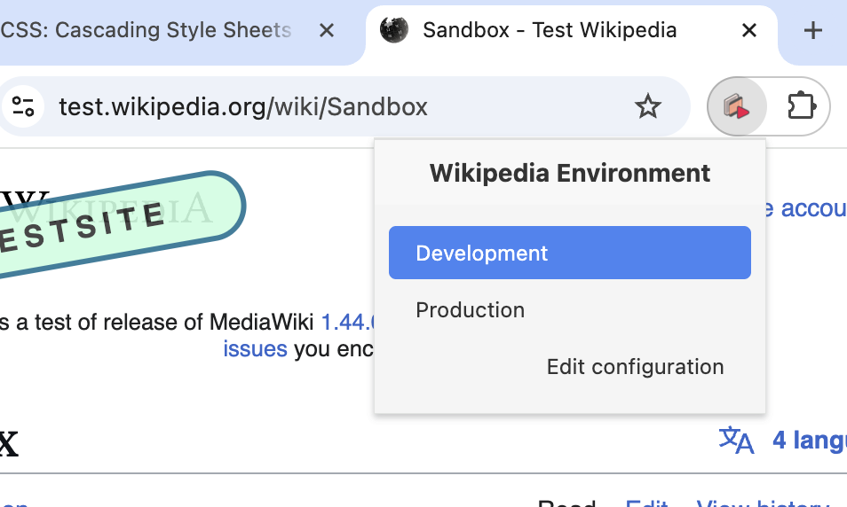
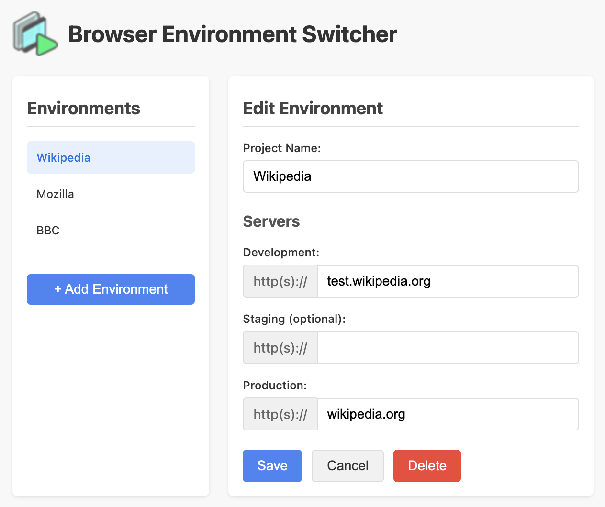

<a name="top"></a>


# Browser Environment Switcher

A browser extension that makes it easy to switch between development, staging, and production environments while maintaining your current path.


## Features

- One-click switching between environments
- Automatic environment detection
- Visual indicators for current environment
- Customizable environment configurations
- Works across multiple domains/projects

## Screenshots

| Popup Interface | Options Page |
|----------------|--------------|
|  |  |


---

## Usage

1. Configure your environments in the options page
2. Browse to any configured site
3. Click the extension icon to see available environments
4. Select an environment to switch to it

## Installation

### Chrome
1. Download the latest release
2. Open chrome://extensions
3. Enable "Developer mode"
4. Click "Load unpacked" and select the extension directory


---

# Safari Compatibility Notes

Safari supports web extensions through its Safari Web Extension framework. Here are important compatibility considerations for the Browser Environment Switcher when targeting Safari:

## API Compatibility

Safari supports most Chrome extension APIs through compatibility layers, with a few key differences:

1. **Service Workers**: Safari supports service workers, but there may be subtle differences in behavior. We should test the background.js service worker carefully in Safari.

2. **Storage API**: Safari fully supports `chrome.storage.local`, which is what we're using.

3. **Tabs API**: Safari supports the `chrome.tabs` API, but there may be permission differences.

4. **Action API**: Safari supports `chrome.action` for the extension toolbar button.

## Building Process

To build for Safari:

1. First, ensure the extension works in Chrome
2. Use the Safari Web Extension Converter tool in Xcode.  From the parent directory of your code run:
   ```
   xcrun safari-web-extension-converter ./browser-environment-switcher --app-name "EnvSwitcher" --bundle-identifier "com.desatt.envswitcher"
   ```
3. The tool will create a new Xcode project
4. You'll need to sign the extension with your Apple Developer account
5. Ensure the Team is properly set, and the identifier bundles need to match for the app and extension (don't let xcode add .extension, that appears to fail)
6. You can then build and install the extension


## Safari-Specific Issues to Watch For

1. **Extension Signing**: Safari requires all extensions to be signed with an Apple Developer account.

2. **Performance**: Test the extension performance in Safari, especially the background script.

3. **Content Security Policy**: Safari may enforce stricter Content Security Policy rules.

4. **Permissions**: Safari's permission model may require adjustments to our host permissions.

5. **UI Appearance**: Safari has different styling guidelines for extension UIs.

## Testing in Safari

Before deploying:

1. Test the environment detection logic
2. Verify the icon changes correctly
3. Ensure the popup UI displays and functions properly
4. Confirm that environment switching works as expected

## Debugging in Safari

To debug Safari extensions:

1. Enable the "Develop" menu in Safari preferences
2. Use the Web Inspector to debug the extension's background and content scripts
3. Look for any console errors specific to Safari

## Safari Extension Distribution

To distribute for Safari:

1. Submit the extension to the Apple App Store as a Safari extension
2. Follow Apple's review guidelines
3. Users will install via the App Store rather than direct download

Note: For internal use, you can distribute the .app file directly to users.

[Back to top](#top)