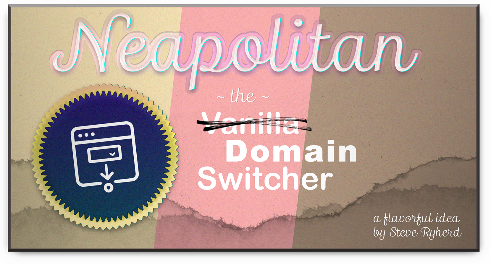
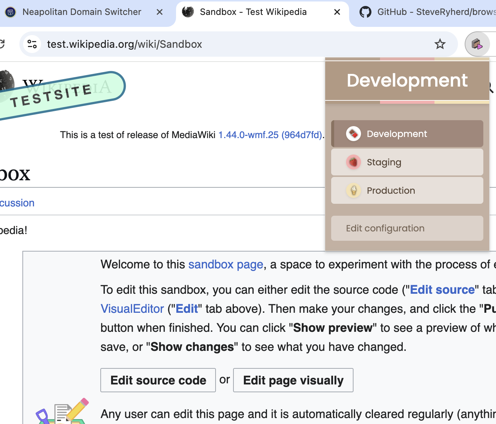
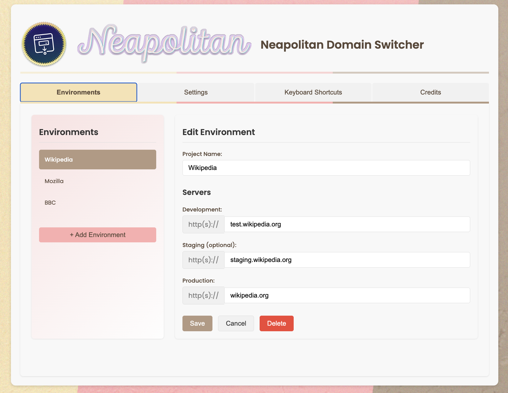

<a name="top"></a>



# Neapolitan — Browser Environment Switcher

[](https://chromewebstore.google.com/detail/neapolitan-domain-switcher/pbmeeanefgoglnbaikepdhmdjhohodbc)
[](LICENSE)
[](CHANGELOG.md)
[](https://neapolitan.page)

A browser extension that switches the page you're on between development, staging, and production — preserving the path, query string, and hash. So you can compare environments without losing your place.

## Features

- One-keystroke switching between dev / staging / prod
- **Path preservation** — `/orders/42?status=open` follows you across environments
- Visual indicators for the current environment (chocolate / strawberry / vanilla)
- Four built-in [keyboard shortcut schemes](.github/KEYBOARD_SHORTCUTS.md) (Classic, Neapolitan, Easy as 1·2·3, Banana Split)
- Customizable environment configurations per project
- Works across multiple domains/projects
- **No data collected.** No analytics, no telemetry, no remote servers. [Read the privacy policy](PRIVACY.md).

## Screenshots

| Popup Interface | Options Page |
|----------------|--------------|
|  |  |

## Quick Demo


---

## Install

### Chrome / Edge / Brave / Arc / Vivaldi

[Install from the Chrome Web Store →](https://chromewebstore.google.com/detail/neapolitan-domain-switcher/pbmeeanefgoglnbaikepdhmdjhohodbc)

### Safari

Safari requires additional steps. See the [Safari Installation Guide](.github/SAFARI_INSTALLATION.md).

### From source (for development)

```sh
git clone https://github.com/SteveRyherd/neapolitan.git
cd neapolitan
./build-chrome.sh
```

Then in Chrome: `chrome://extensions` → enable Developer mode → "Load unpacked" → select the build output.

## Usage

1. Open the extension's options page and define your project's environments (e.g. `localhost:3000` → dev, `staging.acme.com` → staging, `acme.com` → prod)
2. Visit any configured site
3. Press `Alt+X` / `Alt+S` / `Alt+W` (defaults) to switch the current tab to dev / staging / prod
4. Or click the extension icon for a visual popup with the same options

> **One-time Chrome setup:** Chrome reserves keyboard shortcut binding for the user, so after installing you'll bind keys at `chrome://extensions/shortcuts`.

## Project structure

```
.
├── manifest.json              Extension manifest (MV3)
├── src/
│   ├── background.js          Service worker
│   ├── popup/                 Popup UI
│   └── options/               Options page
├── icons/                     Extension icons (all sizes)
├── docs/                      Landing page (neapolitan.page) — Cloudflare Pages
├── design/                    Source design files (PSDs)
├── .github/
│   ├── README.md              GitHub-rendered project doc
│   ├── KEYBOARD_SHORTCUTS.md  Shortcut scheme reference
│   ├── SAFARI_INSTALLATION.md
│   └── screenshots/           Marketing screenshots
├── build-chrome.sh            Package Chrome extension
├── build-safari.sh            Package Safari extension
├── CHANGELOG.md
├── PRIVACY.md
└── LICENSE
```

## Contributing

Issues and PRs welcome. Currently a solo project, so responses may be slow.

## License

[MIT](LICENSE) © 2013–2026 Steve Ryherd

---

Built and maintained by [Steve Ryherd](https://steveryherd.com). [Project site →](https://neapolitan.page)

[Back to top](#top)
